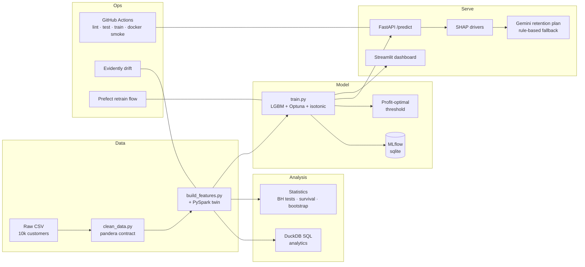

# Business Churn Prediction — End-to-End Data Science Project

[](https://github.com/AntonyMittul/Business_Chrun_Prediction/actions)
[](https://businesschrunprediction-d5qzzmztbi7kbzurkbasvf.streamlit.app/)

**🔴 Live demo:** [businesschrunprediction.streamlit.app](https://businesschrunprediction-d5qzzmztbi7kbzurkbasvf.streamlit.app/) —
risk work-queue, per-customer SHAP drivers, and Gemini-generated retention plans.

Predicting customer churn for a subscription business, built as a **complete data-science
lifecycle**: SQL analytics → statistical inference → feature engineering → calibrated ML →
explainability → GenAI → a deployed, monitored, CI-tested service.

**The result in one sentence:** a calibrated LightGBM (ROC-AUC **0.816**, PR-AUC **0.351**)
whose profit-optimized decision threshold makes the retention campaign **7.1× more
profitable** than the naive 0.5 cutoff, with every prediction explained by SHAP and turned
into a concrete retention action by Gemini.

---

## Architecture



## Results

| Metric | Value | Context |
|---|---|---|
| ROC-AUC (test) | **0.816** | honest performance on weak-signal data |
| PR-AUC (test) | **0.351** | 3.4× the 10.2% no-skill baseline |
| Brier score | **0.077** | isotonic-calibrated — probabilities are decision-grade |
| Decision threshold | **0.16** | chosen on train-OOF profit, never on test |
| Retention profit (test) | **$6,867 vs $966** | **7.1×** the default-0.5 threshold |
| Churner recall at threshold | **82%** | catches 4 of 5 churners |

## Key findings (SQL + statistics, before any ML)

| Driver | Effect | Retention lever |
|---|---|---|
| First 6 months of tenure | **28.1%** churn (3× baseline; bootstrap CI 17–23pp) | onboarding program |
| ≥ 2 payment failures | **21–33%** churn (sharp threshold at 2) | dunning flow at 2nd failure |
| CSAT ≤ 2 | **24–26%** churn (strongest effect, d = −0.53) | CSAT-triggered save call |
| Inactive > 30 days | **~2×** churn (invisible to global tests — threshold-shaped) | 30-day re-engagement |
| **Compound** (low CSAT + payment issues) | **37.3%** churn | escalate to human specialist |
| Segment, contract, NPS, ticket volume, geography | **flat ≈ 10%** — confirmed noise | none |

Only 4 of 23 features survive Benjamini-Hochberg correction. Survival analysis (Cox):
each +1 CSAT point cuts churn hazard **36%**; each payment failure adds **45%**.
`total_revenue` was exactly `fee × tenure` (dropped); `city`×`country` pairs are
independently random (geography = noise). **SMOTE was tested and lost** — imbalance is
handled at the profit threshold instead.

## The GenAI layer

Every flagged customer gets: SHAP top-drivers → **Gemini** (`gemini-3.1-flash-lite`)
→ a structured retention plan (risk level, plain-English drivers, actions each grounded
in a driver). No API key? A rule-based fallback built from the statistical findings
answers instead — the `source` field always tells you which path replied.

## Quickstart

```bash
git clone https://github.com/AntonyMittul/Business_Chrun_Prediction
cd Business_Chrun_Prediction

# venv OUTSIDE OneDrive-synced folders (sync locking breaks pip)
python -m venv %USERPROFILE%\.venvs\churn
%USERPROFILE%\.venvs\churn\Scripts\activate
pip install -r requirements-dev.txt   # full stack; requirements.txt = lean runtime only

pytest                              # 23 tests
python -m src.pipelines.flow        # Prefect: clean -> features -> train -> drift
```

| Want to... | Run |
|---|---|
| Serve the API | `uvicorn src.api.main:app` → http://127.0.0.1:8000/docs |
| Open the dashboard | [live demo](https://businesschrunprediction-d5qzzmztbi7kbzurkbasvf.streamlit.app/) · locally: `run_dashboard.bat` |
| Browse experiments | `mlflow ui --backend-store-uri sqlite:///mlflow.db` |
| Build the container | `docker build -t churn-api .` (trains at build time; smoke-tested in CI) |
| GenAI plans | put `GEMINI_API_KEY=...` in `.env` (see `.env.example`) |

## Repo tour

```
notebooks/           01 SQL analytics · 02 EDA · 03 statistics · 04 feature audit
                     05 modeling · 06 SHAP + GenAI          (all executed, with outputs)
src/data/            loading, cleaning, pandera schema contract
src/features/        feature engineering (pandas + PySpark twin)
src/models/          train.py (MLflow), explain.py (SHAP)
src/genai/           Gemini retention advisor + fallback
src/api/             FastAPI service
src/monitoring/      Evidently drift report
src/pipelines/       Prefect retrain flow
app/                 Streamlit dashboard
tests/               23 tests (data, features, model, API, advisor)
reports/figures/     14 generated figures
reports/MODEL_CARD.md  model card (intended use, metrics, limitations)
```

## Dataset

[Customer Churn Prediction Business Dataset](https://www.kaggle.com/datasets/miadul/customer-churn-prediction-business-dataset)
(Kaggle, synthetic-but-realistic; 10,000 × 32, 10.21% churn). Committed to the repo
(1.7MB) so everything — tests, CI, Docker build — is reproducible from a bare clone.

## Tech stack

Python · pandas · **DuckDB** (SQL) · SciPy/statsmodels/**lifelines** (inference & survival)
· scikit-learn · **LightGBM** · Optuna · imbalanced-learn · **MLflow** · **SHAP** ·
**Gemini API** · pandera · **PySpark** · FastAPI · Streamlit · **Docker** ·
**GitHub Actions** · Evidently · **Prefect**

## Roadmap (complete)

- [x] **Phase 0** — Project setup & scaffolding
- [x] **Phase 1** — Data cleaning & validation (pandas + pandera schema contract)
- [x] **Phase 2** — EDA + SQL analytics (DuckDB — business questions in pure SQL)
- [x] **Phase 3** — Statistics & probability (hypothesis testing, effect sizes, survival analysis)
- [x] **Phase 4** — Feature engineering + leakage audit (pandas → PySpark on Databricks)
- [x] **Phase 5** — Modeling, MLflow & cost-sensitive threshold tuning
- [x] **Phase 6** — Explainability (SHAP) + GenAI retention advisor (Gemini)
- [x] **Phase 7** — Deployment, CI/CD & monitoring (FastAPI · Docker · GitHub Actions · Evidently · Prefect)
- [x] **Phase 8** — Polish, model card & write-up

## License

Educational / portfolio use. Dataset © its Kaggle author.
